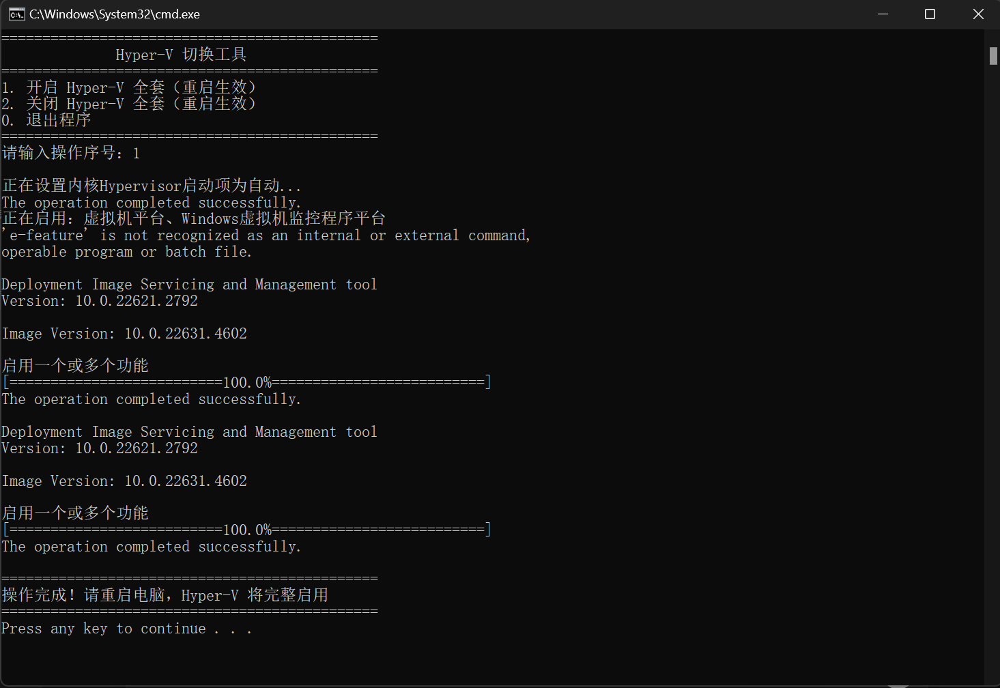

<h1 align="center">Hyper-V Switcher（Hyper-V 切换工具）</h1>

<p align="center">
  
  
  
  
</p>

---

<p align="center">
  <strong><a href="#installation">安装</a></strong> •
  <strong><a href="#what-is-it">这是什么？</a></strong> •
  <strong><a href="#problem">解决了什么问题？</a></strong> •
  <strong><a href="#usage">使用方法</a></strong> •
  <strong><a href="#screenshot">运行截图</a></strong> •
  <strong><a href="#license">开源许可证</a></strong>
</p>

<p align="center">
  <a href="./README.md">English</a> •
  <a href="./README.zh-CN.md">简体中文</a>
</p>

---

## 这是什么？

**Hyper-V Switcher（Hyper-V 切换工具）** 是一个轻量级 Windows 批处理脚本，让你**一键开启或关闭 Hyper-V**——不用再死记硬背 `bcdedit` 和 `dism` 命令，也不用反复打开命令提示符。

它完整管理以下组件：
- **Hypervisor 启动类型**（`bcdedit /set hypervisorlaunchtype`）
- **虚拟机平台** 功能（`dism /online /enable-feature ...`）
- **Windows 虚拟机监控程序平台** 功能（`dism /online /enable-feature ...`）

## 解决了什么问题？

| 场景 | 没有这个工具 | 使用 Hyper-V Switcher |
|:---|:---|:---|
| **为 WSL2/Docker 开启 Hyper-V** | 以管理员打开 CMD → 手动执行 `bcdedit` → 执行 `dism` × 2 → 重启 | 双击 `.bat` → 输入 `1` → 重启完成 ✅ |
| **为 VMware/VirtualBox 关闭 Hyper-V** | 以管理员打开 CMD → 手动执行 `bcdedit` → 执行 `dism` × 2 → 重启 | 双击 `.bat` → 输入 `2` → 重启完成 ✅ |
| **频繁来回切换** | 每次都要重新输入所有命令 | 同一个菜单，每次都一样 |

Hyper-V 与 **VMware**、**VirtualBox** 等其他虚拟化平台以及部分**带反作弊的游戏**存在冲突。本工具让切换变得轻松自如。

## 安装

1. [下载](../../archive/refs/heads/main.zip) 或克隆仓库：
   ```bash
   git clone https://github.com/Je-taimais/HyperV-Switcher.git
   ```
2. **右键** `切换HyperV.bat` → **以管理员身份运行**

就这么简单。无需安装，无任何依赖。

## 使用方法

| 选项 | 操作 | 需要重启？ |
|:---:|:---|:---:|
| `1` | 开启 Hyper-V 全套功能 | 是 |
| `2` | 关闭 Hyper-V 全套功能 | 是 |
| `0` | 退出程序 | 否 |

> ⚠️ **需要管理员权限。** 如果未以管理员身份运行，脚本会自动检测并提醒你。

## 运行截图



## 开源许可证

本项目基于 [MIT License](LICENSE) 开源协议发布。

---

<p align="center">
  Made with ❤️ by <a href="https://github.com/Je-taimais">Je-taimais</a> · <a href="README.md">English</a>
</p>
